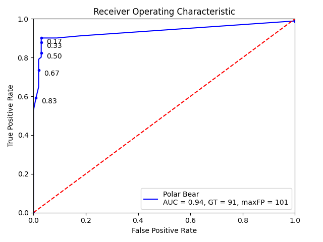
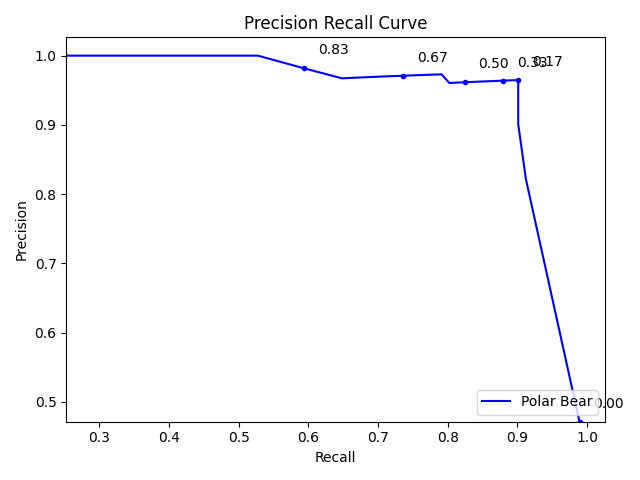
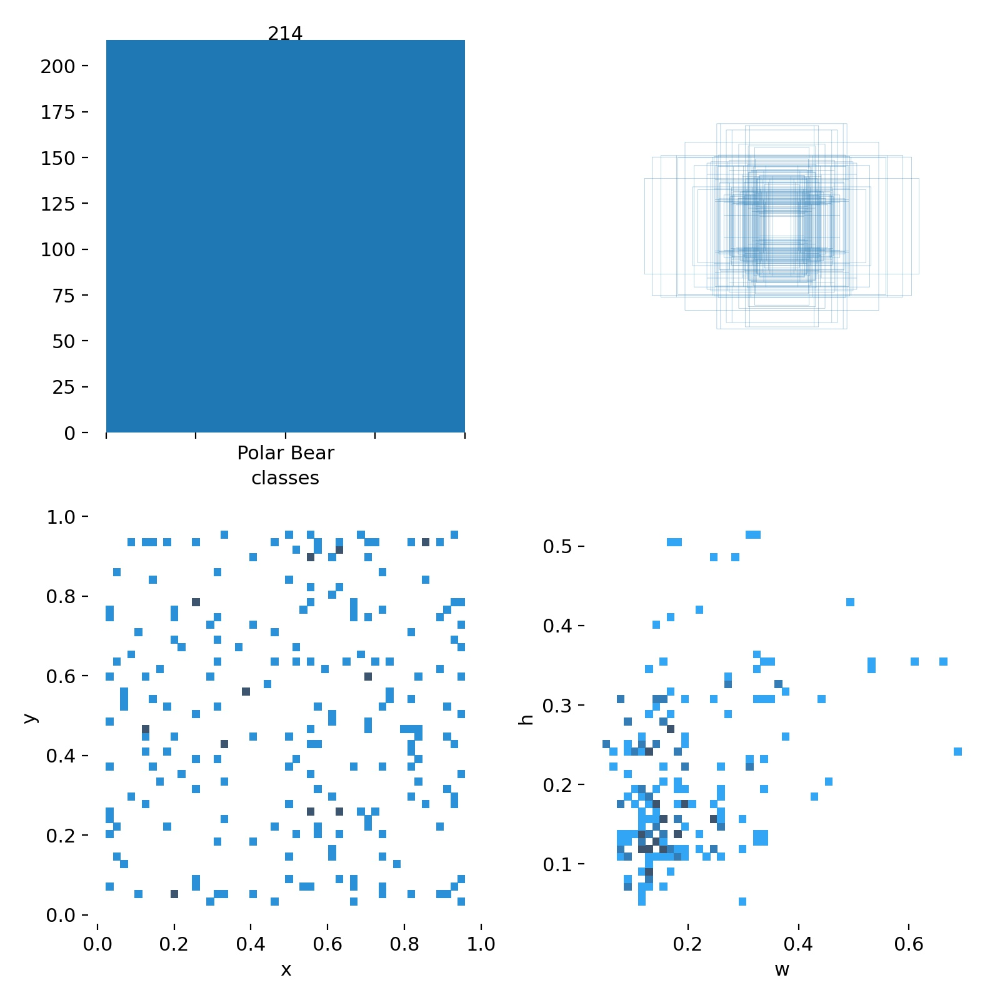
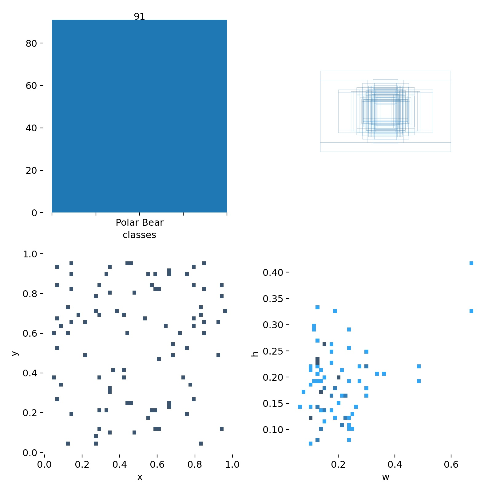
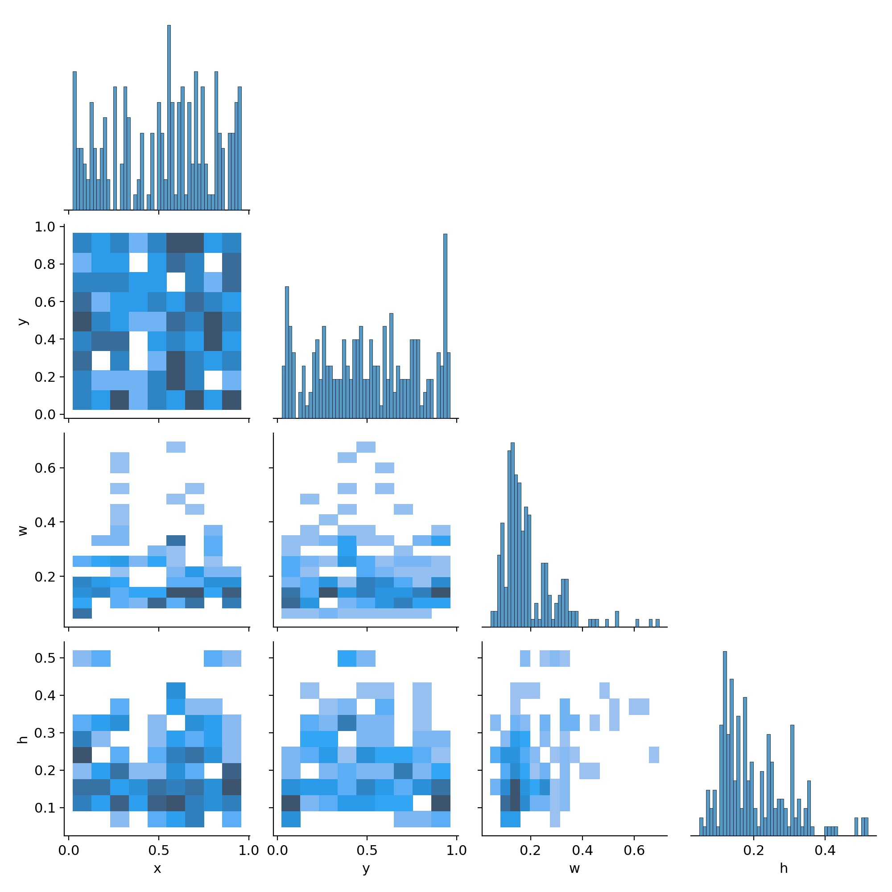
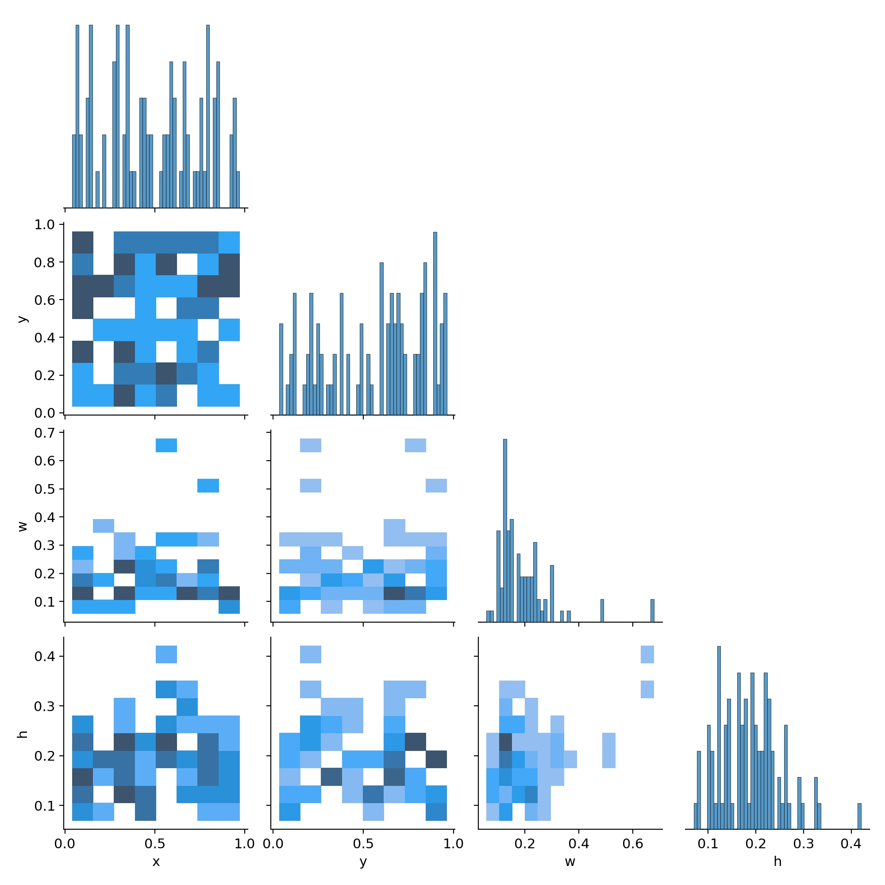

# eo_pb_yolo_tiny_3l

| Model Info    |  |
| ------------- | ------------- |
| Input Size    | 416x416      |
| Classes       | Polar Bear    |
| Detection layers       | P5/32, P4/16, P3/8    |
| Iterations       | ~7,000  |
| Repo | AlexyAB/darknet b5ff7f4 |
| Initialization       | yolov3-tiny.conv.15  |
| Network       | [eo_pb_yolo_tiny_3l.cfg](model/eo_pb_yolo_tiny_3l.cfg)  |

| Dataset Info    |  |
| ------------- | ------------- |
| Background Ratio Train | N/A     |
| Background Ratio Test | N/A    |

**Benchmark speed (1080ti,batch_size=1): 371.2 FPS**

| Results @ .1 IOU, Thresh = .1    | Hotspot |
| ------------- | ------------- |
| TP | 78     |
| FP | 6     |
| FN | 13     |
| Precision | .93     |
| Recall | .86    |

### Model Performance

Train Set          |  Test Set
:-------------------------:|:-------------------------:
  |  
   |   

