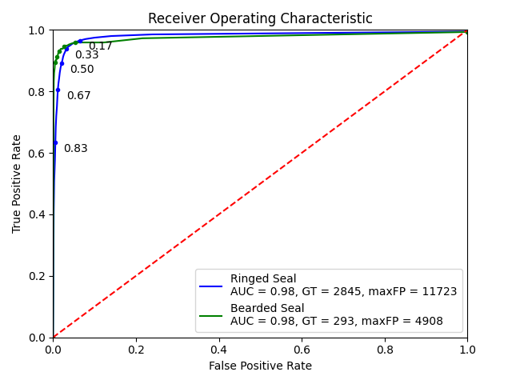
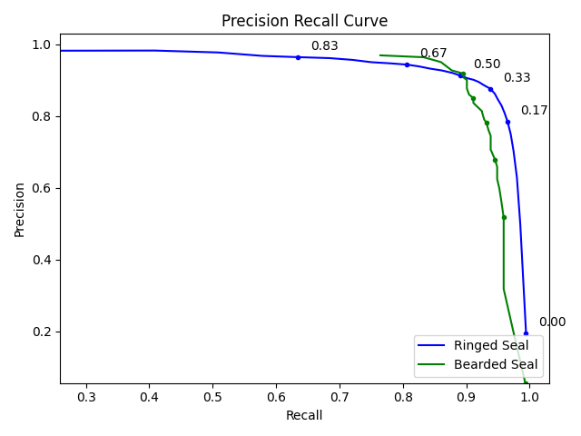
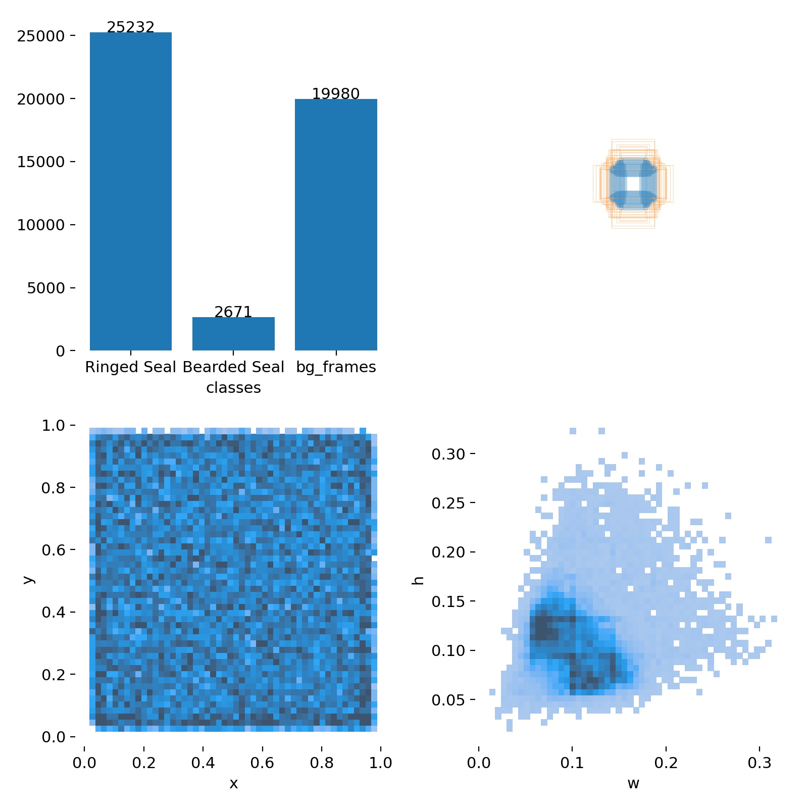
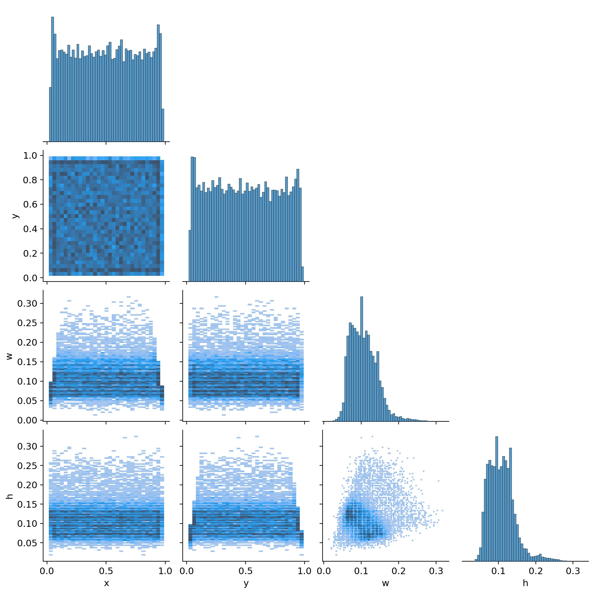
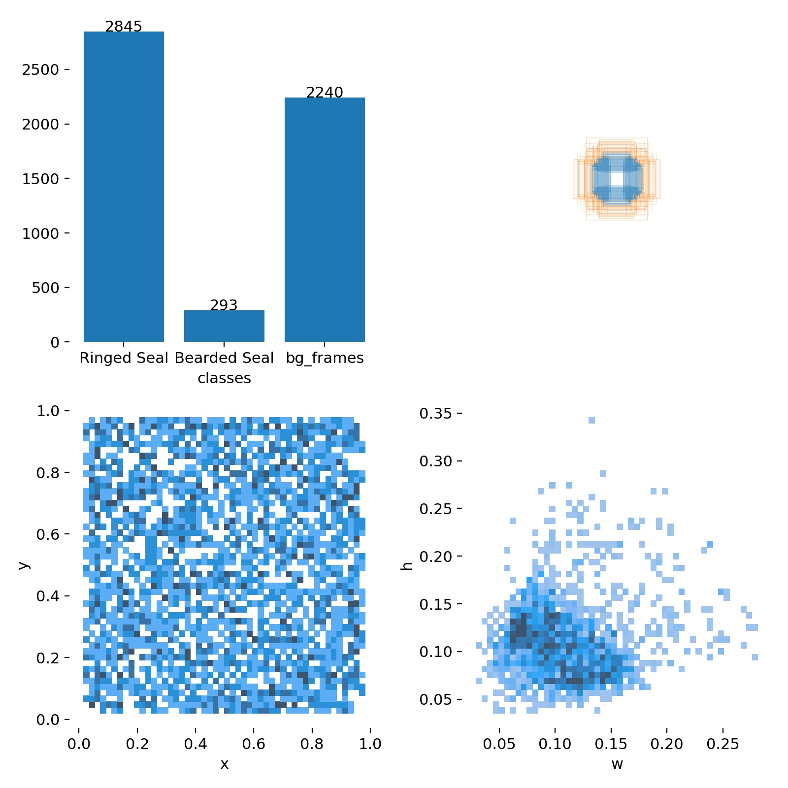
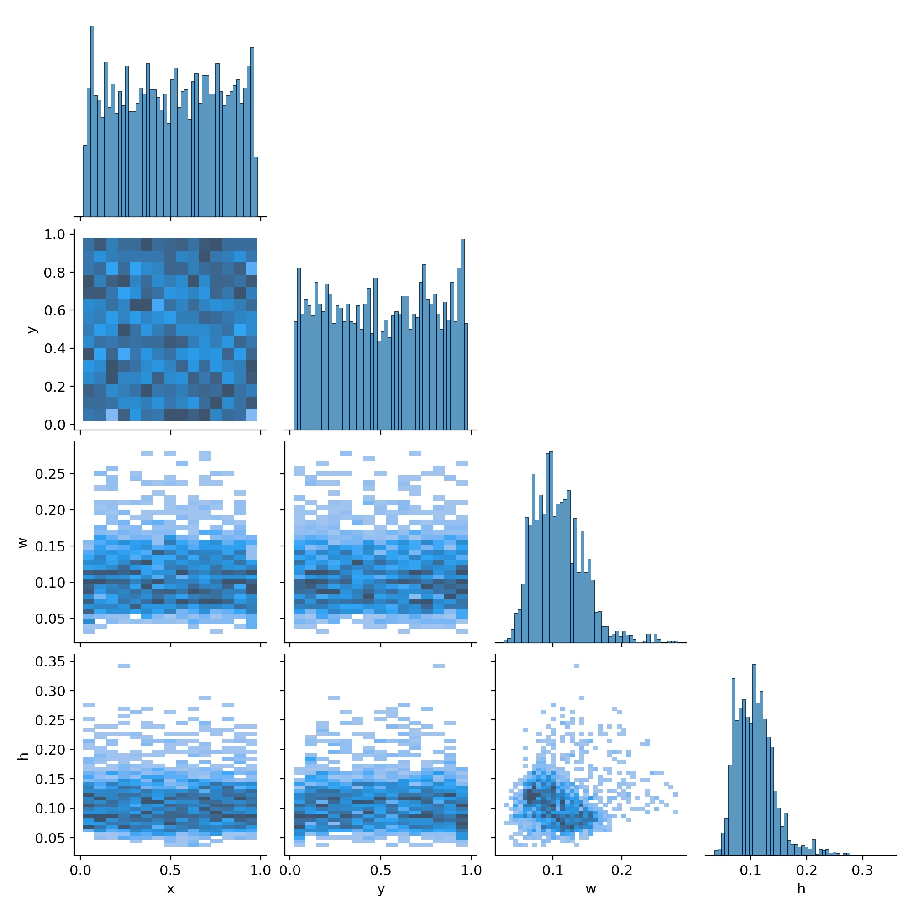

# eo_seals_yolo_tiny_3l_512_1to1bg_nounk

| Model Info    |  |
| ------------- | ------------- |
| Input Size    | 512x512       |
| Classes       | Ringed Seal, Bearded Seal    |
| Detection layers       | P5/32, P4/16, P3/8    |
| Epochs       | ~60,000   |
| Initialization       | yolov3-tiny.conv.15   |

| Dataset Info    |  |
| ------------- | ------------- |
| Background Ratio Train | ~1:1     |
| Background Ratio Test | ~1:1     |

**Benchmark speed (1080ti,batch_size=1):**

| Results @ .25 IOU, Thresh = .25    | Ringed Seal | Bearded Seal  | Combined |
| ------------- | ------------- | ------------- | ------------- |
| TP | 2645     |  283 | 2928     |
| FP | 423     | 141  | 564     |
| FN | 200     | 10  | 210     |
| Precision | 0.87     |  .67 | 0.84     |
| Recall | 0.93     |  .93 |  .93 |

### Model Performance

## Train Set
### Class distributions

### Label Correlogram

## Test Set
### Class distributions

### Label Correlogram
