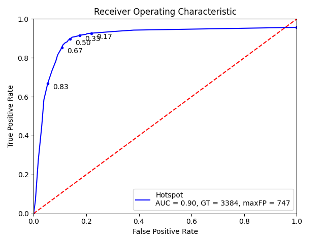
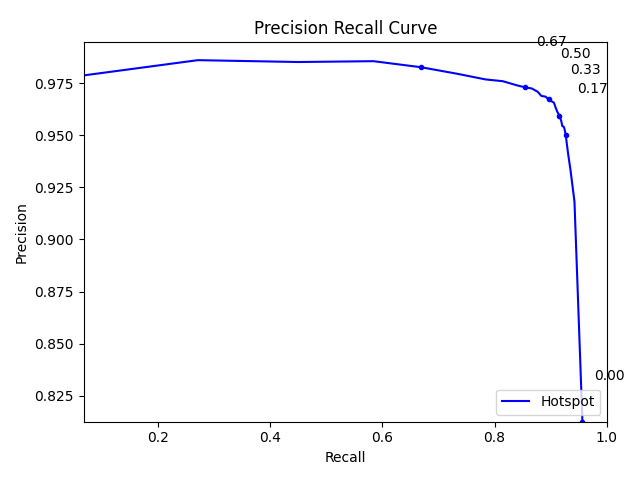
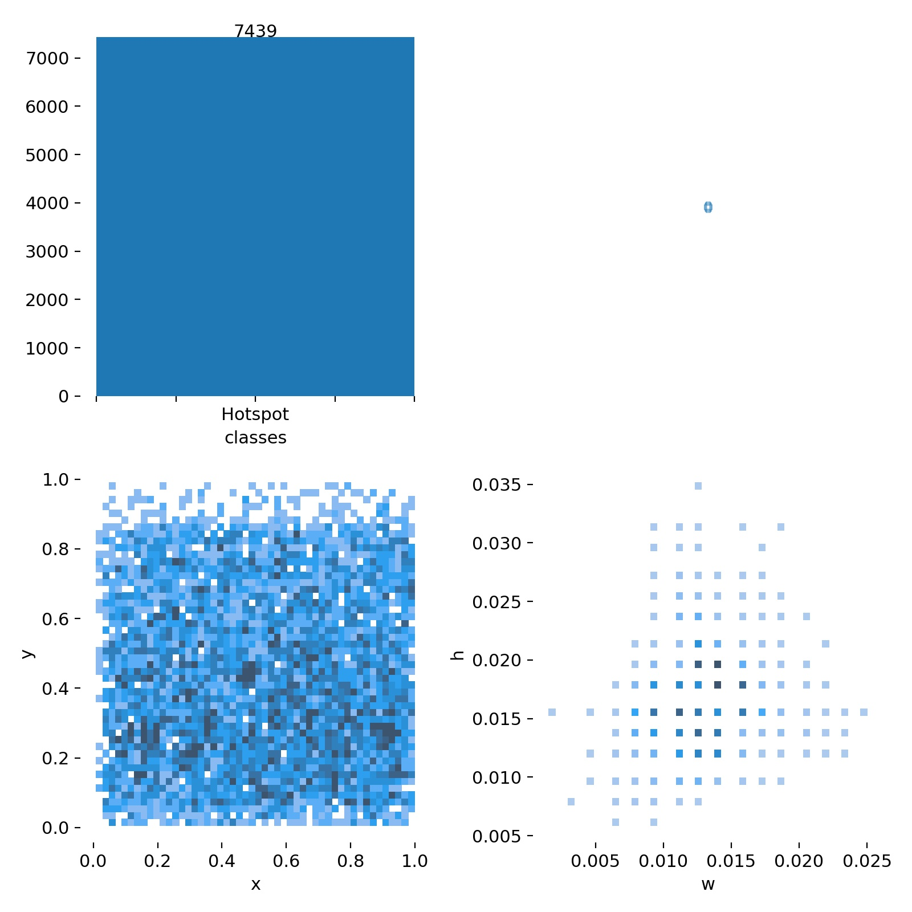
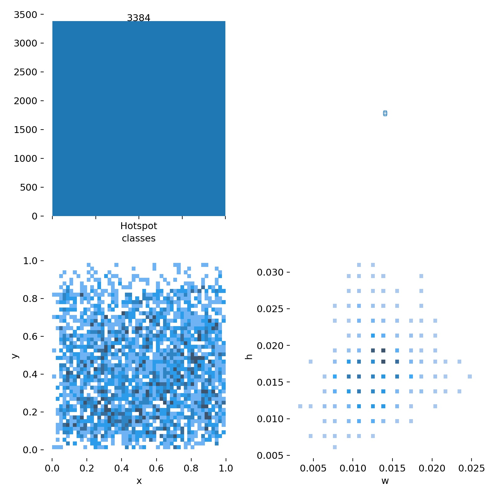
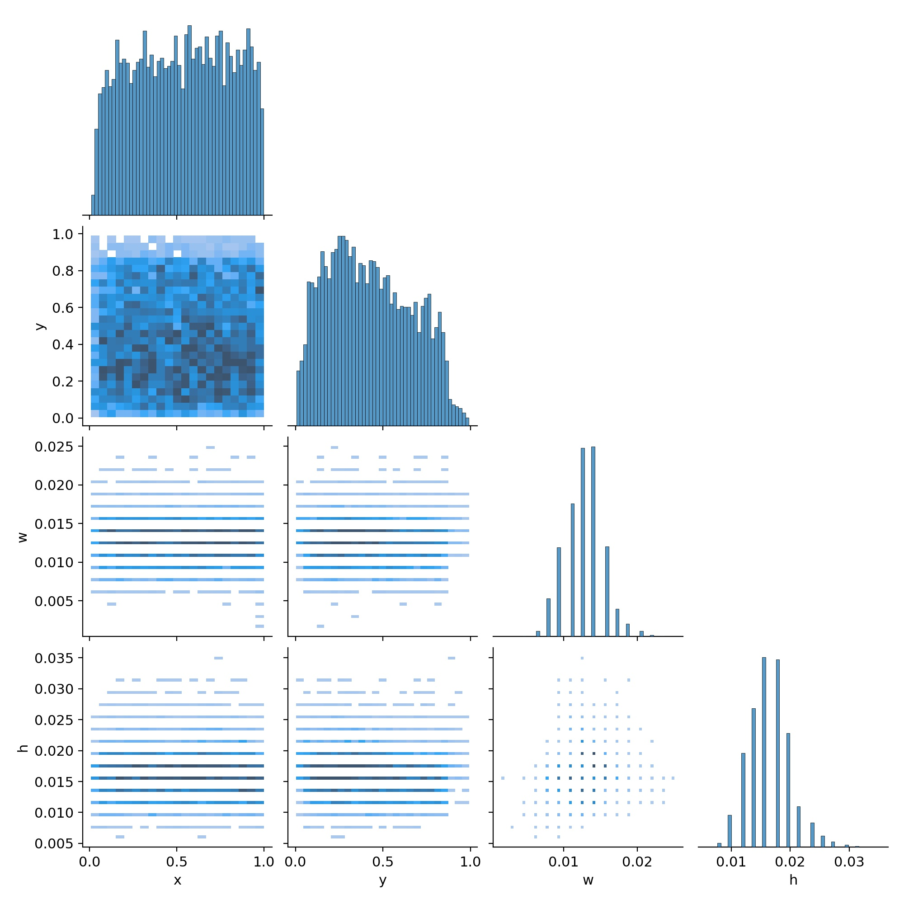
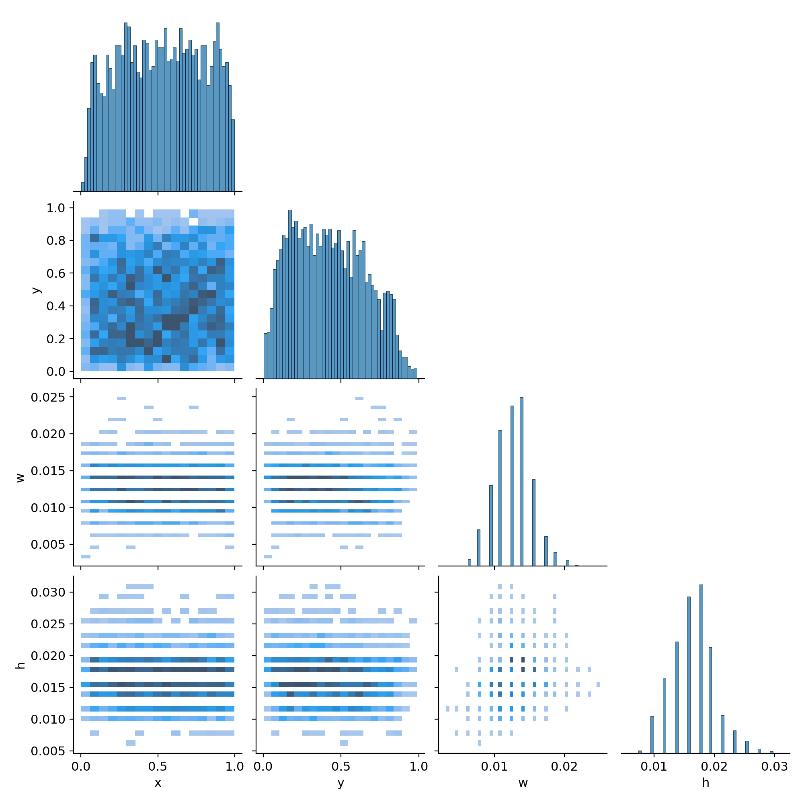

# ir_yolo_tiny_1L64x80

| Model Info    |  |
| ------------- | ------------- |
| Input Size    | 512x640       |
| Classes       | Hotspot    |
| Detection layers       | P3/8    |
| Iterations       | ~24,000   |
| Batch Size       | 64 |
| Repo | AlexyAB/darknet b5ff7f4 |
| Initialization       | random  |
| Network       | [ir_yolo_tiny_1L64x80.cfg](model/ir_yolo_tiny_1L64x80.cfg)  |

| Dataset Info    |  |
| ------------- | ------------- |
| Background Ratio Train | ~1:1     |
| Background Ratio Test | ~1:1     |

**Benchmark speed (1080ti,batch_size=1): 303.7 FPS**

| Results @ .1 IOU, Thresh = .1    | Hotspot |
| ------------- | ------------- |
| TP | 3152     |
| FP | 431     |
| FN | 232     |
| Precision | .88     |
| Recall | .93    |

### Model Performance

Train Set          |  Test Set
:-------------------------:|:-------------------------:
  |  
   |   

